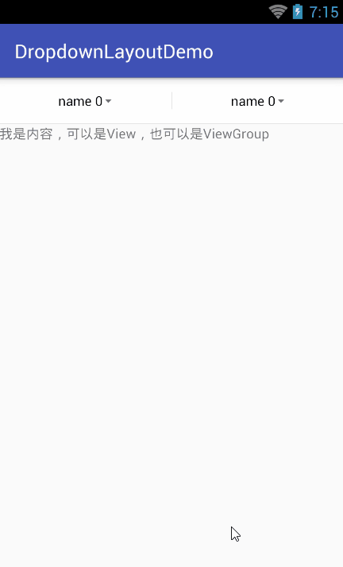

# LQRDropdownLayoutLibrary
下拉导航菜单，使用非常简单

##***LQRDropdownLayout***
该项目是下拉导航菜单，使用非常简单。基于FilterDropDownMenu-master项目进行封装，因为原项目的使用太复杂了，光布局就得几十行代码，如果项目中多处用到下拉菜单，那代码的冗余度就太大了,故本布局对其进行精简，并增加更多效果（如：选中时条目的背景及旁边的图标都可自定义等）,使用时仅仅只要2个步骤：

###1、导入

	compile 'com.lqr.dropdownLayout:library:1.0.0'

###2、设置布局

	<com.lqr.dropdownLayout.LQRDropdownLayout
        android:id="@+id/dl"
        android:layout_width="match_parent"
        android:layout_height="match_parent"
        app:ddl_item_selected__drawable="@mipmap/ic_task_status_list_check"
        app:ddl_item_text_gravity="left"
        app:ddl_list_max_height="250dp"
        app:ddl_top_btn_noraml_drawable="@mipmap/ic_dropdown_normal"
        app:ddl_top_btn_selected_drawable="@mipmap/ic_dropdown_actived"/>

###3、代码控制
	
	LQRDropdownLayout mDl = (LQRDropdownLayout) findViewById(R.id.dl);
    mDl.setCols(2);

    //创建内容区
    TextView tv = new TextView(this);
    tv.setText("我是内容，可以是View，也可以是ViewGroup");

    //创建下拉列表数据
    final List<Map<String, String>> listData = new ArrayList<>();
    for (int i = 0; i < mDl.getCols(); i++) {
        //这里使用LinkedHashMap是为了让下拉列表的条目有序
        Map<String, String> map = new LinkedHashMap<>();
        for (int j = 0; j < 6; j++) {
            map.put("name " + j, "value " + j);
        }
        listData.add(map);
    }

	//初始化（该方法必须调用）
    mDl.init(tv, listData);
	//设置菜单点击监听
    mDl.setOnDropdownListListener(new LQRDropdownLayout.OnDropdownListListener() {
        @Override
        public void OnDropdownListSelected(int indexOfButton, int indexOfList, String textOfList, String valueOfList) {

        }

        @Override
        public void onDropdownListOpen() {

        }

        @Override
        public void onDropdownListClosed() {

        }
    });

###4、可实现的效果如下：

###5、其他设置
由于该控件的可自定义属性太多，这里就一一举例了，请看其自定义属性
	
	<resources>
    <declare-styleable name="DropdownLayout">
        <!--下拉列表的列数-->
        <attr name="ddl_cols" format="integer"/>
        <!--下拉按钮与下拉列表中只显示一个，如果在下拉列表中选择了item5，则item5消失，下拉按钮显示item5的name-->
        <attr name="ddl_only_show_one" format="boolean"/>

        <!--下拉按钮区背景-->
        <attr name="ddl_top_bg" format="color"/>
        <!--下拉按钮区的高度-->
        <attr name="ddl_top_height" format="dimension"/>
        <!--下拉按钮区的分割线颜色-->
        <attr name="ddl_top_split_line_color" format="color"/>
        <!--下拉按钮区的分割线宽度-->
        <attr name="ddl_top_split_line_width" format="dimension"/>
        <!--下拉按钮区的分割线高度-->
        <attr name="ddl_top_split_line_height" format="dimension"/>

        <!--下拉按钮文本前缀-->
        <attr name="ddl_top_btn_text_prefix" format="string"/>
        <!--下拉按钮文本后缀-->
        <attr name="ddl_top_btn_text_suffix" format="string"/>
        <!--下拉按钮文字大小-->
        <attr name="ddl_top_btn_text_size" format="dimension"/>
        <!--下拉按钮未选中时文字颜色-->
        <attr name="ddl_top_btn_text_normal_color" format="color"/>
        <!--下拉按钮选中时文字颜色-->
        <attr name="ddl_top_btn_text_selected_color" format="color"/>
        <!--下拉按钮文字未选中时显示的图标-->
        <attr name="ddl_top_btn_selected_drawable" format="reference"/>
        <!--下拉按钮文字选中时显示的图标-->
        <attr name="ddl_top_btn_noraml_drawable" format="reference"/>

        <!--下划线宽度-->
        <attr name="ddl_top_bottom_line_width" format="dimension"/>
        <!--下划线高度-->
        <attr name="ddl_top_bottom_line_height" format="dimension"/>
        <!--下划线颜色-->
        <attr name="ddl_top_bottom_line_color" format="color"/>

        <!--分割线颜色-->
        <attr name="ddl_split_line_color" format="color"/>
        <!--分割线宽度-->
        <attr name="ddl_split_line_width" format="dimension"/>
        <!--分割线高度-->
        <attr name="ddl_split_line_height" format="dimension"/>

        <!--遮盖层颜色-->
        <attr name="ddl_mask_bg" format="color"/>

        <!--下拉列表的最大高度-->
        <attr name="ddl_list_max_height" format="dimension"/>

        <!--下拉列表item的左内间距-->
        <attr name="ddl_item_padding_left" format="dimension"/>
        <!--下拉列表item的右内间距-->
        <attr name="ddl_item_padding_right" format="dimension"/>
        <!--下拉列表item的高度-->
        <attr name="ddl_item_height" format="dimension"/>
        <!--下拉列表item文字大小-->
        <attr name="ddl_item_text_size" format="dimension"/>
        <!--下拉列表item未选中时文字颜色-->
        <attr name="ddl_item_text_normal_color" format="color"/>
        <!--下拉列表item选中时文字颜色-->
        <attr name="ddl_item_text_selected_color" format="color"/>
        <!--下拉列表item未选中时背景颜色-->
        <attr name="ddl_item_normal_bg" format="color"/>
        <!--下拉列表item选中时背景颜色-->
        <attr name="ddl_item_selected_bg" format="color"/>
        <!--下拉列表item未选中图标-->
        <attr name="ddl_item_normal_drawable" format="reference"/>
        <!--下拉列表item选中图标-->
        <attr name="ddl_item_selected__drawable" format="reference"/>
        <!--下拉列表item的文字位置-->
        <attr name="ddl_item_text_gravity">
            <enum name="center" value="0"></enum>
            <enum name="left" value="1"></enum>
            <enum name="right" value="2"></enum>
        </attr>

        <!--下拉列表item下划线高度-->
        <attr name="ddl_item_bottom_line_height" format="dimension"/>
        <!--下拉列表item下划线左边距-->
        <attr name="ddl_item_bottom_line_margin_left" format="dimension"/>
        <!--下拉列表item下划线右边距-->
        <attr name="ddl_item_bottom_line_margin_right" format="dimension"/>
        <!--下拉列表item下划线颜色-->
        <attr name="ddl_item_bottom_line_color" format="color"/>

	</declare-styleable>
	</resources>